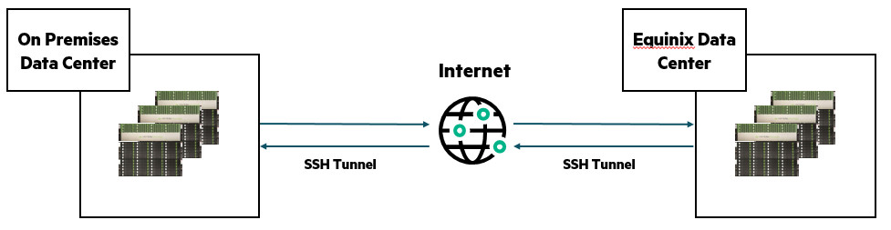
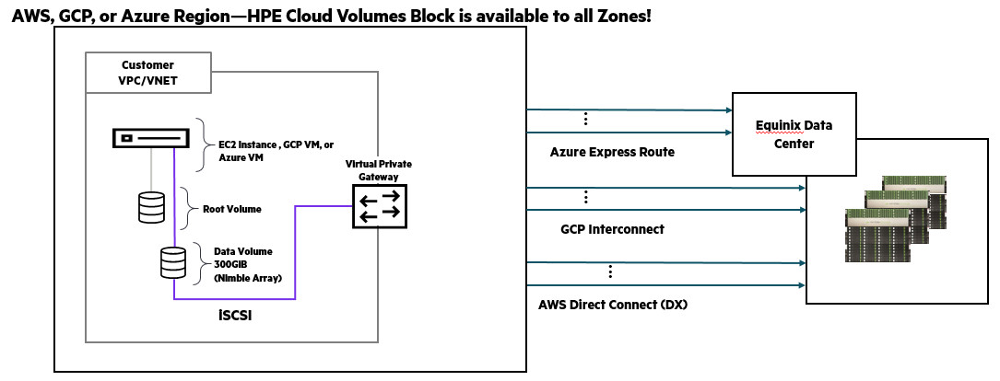
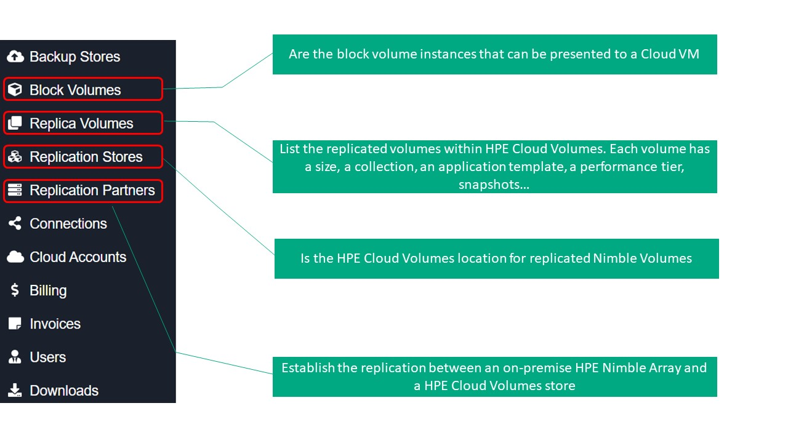

# Welcome to the HPE Developer Hack Shack
[HPE Developer Community Team](https://hpedev.io)

  
  

# HPE Developer Workshop

# Introduction to "Managing HPE Cloud Volumes with API"
HPE Cloud volumes is an entreprise-based cloud storage service that provides storage volumes as a service for use with Amazon web services, Google cloud or Microsoft azure.
One can add storage volumes to a cloud VM on an as-needed basis and at the size and performance level that best fits the needs of your company. For each volume that you add, you can also create snapshots, create clones, encrypt data, add users and monitor performance.

This lab is about learning HPE Cloud Volumes management using the API service provided.

The image below explains how the replication happens between an on-premises HPE Nimble Array and HPE Cloud Volumes which is a service hosted into an Equinix data center (several regions are available).

  
  

Once a volume is available into HPE Cloud Volumes, it can be presented to a cloud provider. At this point in time, AWS, GCP and Azure are supported. The picture below shows briefly the technology underneath.

  
  

To be added:
- Environment presentation

HPE Cloud Volumes interface
API command allows to programatically manage a software. As one may not be familiar with HPE Cloud Volumes, the picture below shows the GUI interface and first level menu.
Only the entries we will access via API are described.

  
  

# Author: [Yann Allandit](mailto:yann.allandit@hpe.com)

## Prerequisites
It is highly recommended you have some basic experience or at least knowledge with the Application Programming Interface -API- before running this lab.
In case you do not feel confortable with this topic, here are some links to start:
* https://developer.hpe.com/blog/understanding-api-basics-and-the-value-they-provide
* https://developer.hpe.com/blog/first-step-with-programming-the-hpe-composable-api

## Handouts
You can freely copy the Jupyter Notebooks, including their output, in order to practice back at your office at your own pace, leveraging a local installation of Jupyter Notebook on your laptop.
- You install the Jupyter Notebook application from [here](https://jupyter.org/install). 
- A Beginners Guide is also available [here](https://jupyter-notebook-beginner-guide.readthedocs.io/en/latest/what_is_jupyter.html)

## Lab flow
HPE Developer Workshops-on-Demand are delivered through a central point that allows a portable, dynamic version of the lab guides. Rather than using standard PDF files which always end in copy / paste errors from the lab guide into the TS sessions, this year we decided to innovate and introduce a brand-new infrastructure. We will leverage a JupyterHub server on which all the different lab guides will be stored in a notebook format (*.ipynb).

In a nutshell, a notebook works as follows:

• A Notebook is a series de cells

• Notebook uses a kernel (visible in the upper right corner of the Notebook)

• Cell can be Markdown or Code (in the selected kernel)

• To Run a cell use:

    o The Play Button at the top
    o Ctrl-Enter (run and stay on same cell)
    o Shift-Enter (run and move to next cell)
    
• Running a markdown cell is just rendering it

• Running a Code cell runs the code and display the output just below the cell

• When a cell is running it displays a [*] to its left, then when finished, it displays a counter of the number of execution of that cell

• You cannot run a cell when another is already running but you can interrupt a running cell with the stop button

Enjoy the labs ! :-)

## Workflow

### Lab 1: Explore HPE Cloud Volumes content
Description: In this section, we’ll establish a connection. Then we will browse how is configured our Cloud Volumes service.
* [Lab 1](1-WKSHP-Cloud-Vol-Explore.ipynb)

### Lab 2: Manipulate the volumes
Description: In this section, we’ll create, present and delete a block volume.
* [Lab 2](2-WKSHP-Cloud-Vol-Manipulate.ipynb)

### Conclusion
* [Lab 3](3-WKSHP-Cloud-Vol-Conclusion.ipynb)

# Thank you!

