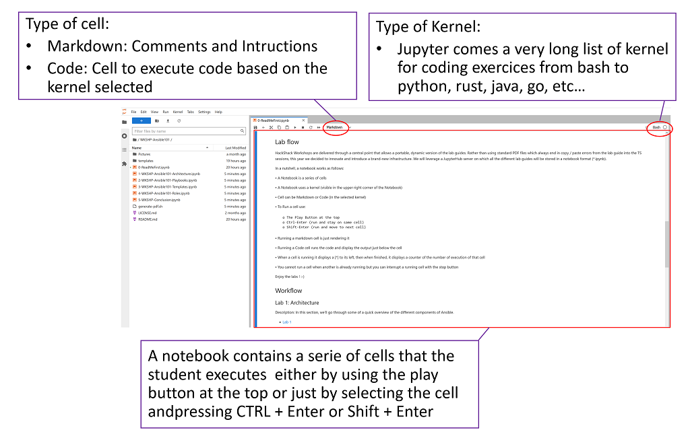
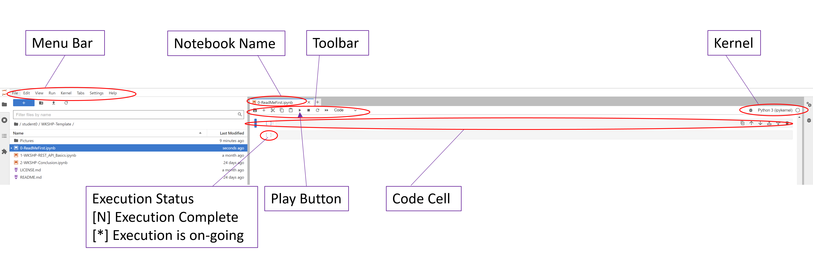

  

# Welcome to the WoD Developer Hack Shack
[WoD Developer Community Team](https://wod.io)

<p align="center">
  
  
</p>

# WoD Developer Workshop


# Introduction to Go 101
In this workshop we’ll cover the basics of Go language. The Go programming language is an open source project designed to make programmers more productive.

Go is expressive, concise, clean, and efficient. Its concurrency mechanisms make it easy to write programs that get the most out of multicore and networked machines, while its novel type system enables flexible and modular program construction. Go compiles quickly to machine code yet has the convenience of garbage collection and the power of run-time reflection. It's a fast, statically typed, compiled language that feels like a dynamically typed, interpreted language.

# Author: [Nida Sahar Rafee](nida@gonife.com) and [Frederic Passeron](frederic.passeron@hpe.com)


## Lab flow
WoD Developer Workshops-on-Demand are delivered through a central point that allows a portable, dynamic version of the lab guides. Rather than using standard PDF files that always end in copy / paste errors from the lab guide into Terminal Server sessions, we leverage an infrastructure that uses a JupyterHub server on which all the different lab guides are stored in a notebook format (*.ipynb).

## A quick look at Jupyter Notebook
Jupyter Notebook is an open source solution for interactive documents that are commonly used to hold code for ML/DL models. But it can also be used in many other ways.
A notebook consists of cells. A cell can be either a markdown cell (contains comments, text, images) or a code cell. 




• A notebook is a series of cells

• The notebook uses a kernel (visible in the upper right corner of the notebook)

• A cell can be either markdown or code (in the selected kernel)





• To run a cell use:

    o The Play button at the top
    o Ctrl-Enter (run and stay on same cell)
    o Shift-Enter (run and move to next cell)
    

> **Note:**  When you see an [*] next to the action, it means your execution step is busy working within the notebook. When you see a digit number, it means the execution of the step is completed.  
    
• Running a markdown cell just renders it

• Running a code cell runs the code and displays the output just below the cell

• When a cell is running, it displays an [*] to its left. Then, when finished, it displays a counter of the number of executions of that cell

• You cannot run a cell when another is already running, but you can interrupt a running cell with the stop button


Enjoy the labs ! :-)

## Handouts
You can freely copy these Jupyter Notebooks, including their output, in order to practice back at your office at your own pace, leveraging a local installation of Jupyter Notebook on your laptop.
- If you want to Install the Jupyter Notebook application on your own laptop for further tests after this workshop, please start from [here](https://jupyter.org/install) 
- If you want to learn more about Notebooks, a Beginners Guide is available [here](https://jupyter-notebook-beginner-guide.readthedocs.io/en/latest/what_is_jupyter.html)

## Workflow

### Lab 1: Lab 1 Collections
Description: In this section, we’ll go through collections definitions. Collections in Go are used to group values of the same type together. Values within a collection can iterated over, or retrieved individually.
* [Lab 1](1-WKSHP-GO101-Collections.ipynb)

### Lab 2: Lab 2 Concurrency
Description: In this section, we’ll go through concurrency definitions. Concurrency refers to a programming language's ability to deal with a lot of things at once.
* [Lab 2](2-WKSHP-GO101-Concurrency.ipynb)

### Lab 3: Lab 3 Defer-Panic-Recover
Description: In this section, we’ll go through defer, panic and recover statements to handle errors.
* [Lab 3](3-WKSHP-GO101-Defer-Panic-Recover.ipynb)

### Lab 4: Lab 4 Dependency Managenent
Description: In this section, we’ll go through the necessary tasks to manage dependencies you take on in your code.
* [Lab 4](4-WKSHP-GO101-Dependency-Management.ipynb)

### Lab 5: Lab 5 Testing
Description: In this section, we’ll go through Testing, a crucial part of software development that ensures your code works as expected.
* [Lab 5](5-WKSHP-GO101-Testing.ipynb)

### Lab 6: Lab 6 Interfaces
Description: In this section, we’ll go through interfaces, which are used to specify behaviors. An interface is defined as a set of method signatures.
* [Lab 6](6-WKSHP-GO101-Interfaces.ipynb)

# Thank you!


```python

```
