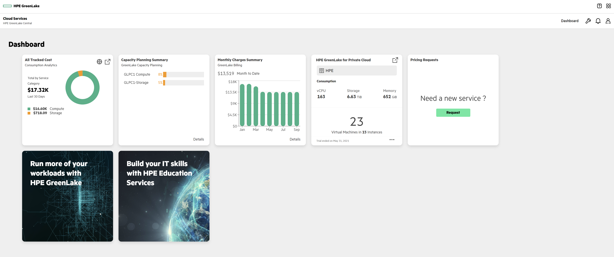

# Welcome to the HPE Developer Hack Shack
[HPE Developer Community Team](https://hpedev.io)

<p align="center">
  
  
</p>

# HPE Developer Workshop


# HPE GreenLake for private cloud API: Extract the power of the Virtual Machines as a Service (VMaaS) API

 


# What is the HPE GreenLake for Private Cloud Enterprise?

The public cloud experience in a private cloud.

The public cloud experience has set expectations for user experience and simplicity, and established benchmarks for time to value—outstripping the performance of legacy IT processes and technologies. But some 70% of apps and data remain outside the cloud 1—constrained by data gravity, security and compliance concerns, latency, performance challenges, and app entanglement. Businesses need a cloud experience that can support their heterogeneous workloads wherever they are, whether in your data center, or at your colocations or edges, including those running in VMs, on bare metal, and in containers. And they need to provide DevOps with self-serve access to these resources.

A private cloud must be as simple to operate as the public cloud. The HPE GreenLake platform provides an automated, flexible private cloud you can use to run, support, and develop any of your apps—in the data center or at a colocation facility or edges. Deploy VMs, bare metal, and containers in any combination across the infrastructure, while users can self-serve their resources through an intuitive user interface, APIs, CLIs, or IaC – just like the public cloud. Moving to your private cloud is simple, as you use familiar hypervisor and container technologies to leverage all your data. And it is delivered as a service, with predictable costs and no upfront payment: you pay for what you use above a reserved amount, based on your consumption—while consumption visibility and analytics help you optimize your spend.

In this workshop we’ll go through some basic usage of the Virtual Machines as a Service API that IT OPS / DEV OPS would use to interact programmatically with their resources. You will see through the basics of the authentication mechanisms. Then you'll get a chance to list a few of these resources available in your tenant. Deploying an instance is a simple but and efficient; you can then perform example one needs to go through too along with all the different actions related to the instance (stop, start, restart, backup...). You will also run some tasks and finally get your hands on a simple blueprint deployment. This workshop does not cover all of the features of the HPE GreenLake VMaaS offering. It simply offers you the possibility to test just a few of them.

# Authors:[Frederic Passeron](mailto:frederic.passeron@hpe.com)    &     [Vinnarasu Ganesan](mailto:vinnarasu.ganesan@hpe.com)  &     [Mathieu Losmede](mailto:mathieu.losmede@hpe.com)

## Handouts
You can freely copy the Jupyter Notebooks, including their output, in order to practice back at your office at your own pace, leveraging a local installation of Jupyter Notebook on your laptop.
- You install the Jupyter Notebook application from [here](https://jupyter.org/install). 
- A Beginners Guide is also available [here](https://jupyter-notebook-beginner-guide.readthedocs.io/en/latest/what_is_jupyter.html)


## Lab flow
HPE Developer Workshops-on-Demand are delivered through a central point that allows a portable, dynamic version of the lab guides. Rather than using standard PDF files which always end in copy / paste errors from the lab guide into the TS sessions, this year we decided to innovate and introduce a brand-new infrastructure. We will leverage a JupyterHub server on which all the different lab guides will be stored in a notebook format (*.ipynb).

## A quick look at Jupyter Notebook
Jupyter Notebook is an open source solution for interactive documents that are commonly used to hold code for ML/DL models. 
A Notebook consists of cells. A cell can be a markdown cell (contains comments, text, images) or a code cell. 

To execute code within the Notebook, you run each cell in turn by clicking on the ***Play button*** in the menu bar of the Notebook.

> **Note:**  When you see a [*] next to the action it means your execution step is busy working within the notebook. When you see a digit number, it means the execution of the step is completed.  


Enjoy the labs ! :-)

## Learn more

Visit HPE GreenLake Developer Portal [here](https://developer.greenlake.hpe.com/docs/greenlake/) for how to get started on HPE GreenLake APIs.

You can also check out the different blog posts on our HPE Developer Community Portal [here](https://developer.hpe.com/platform/hpe-greenlake/home)

Finally, be sure to also look at the [HPE GreenLake Test Drive](https://testdrive.greenlake.hpe.com/) for other possible learning and testing experience. 


## Workflow

### Lab 1: Authentication
Description: In this section, we’ll go through some of the necessary steps to retrieve the API Token necessary for authentication. Then we will look some of the components used to build, deploy a new instance.
* [Lab 1](1-WKSHP-VMAAS-Authentication.ipynb)

### Lab 2: Instance Creation
Description: In this section, we’ll go through some of basics actions to create an instance and then manage it (stop / start / suspend, etc...)
* [Lab 2](2-WKSHP-WKSHP-VMAAS-Instance.ipynb)

### Lab 3: Instance Management
Description: In this section, we’ll go through some additional instance management features like snapshotting, cloning.
* [Lab 3](3-WKSHP-VMAAS-Instance-Advanced.ipynb)


# Thank you!


```python

```
