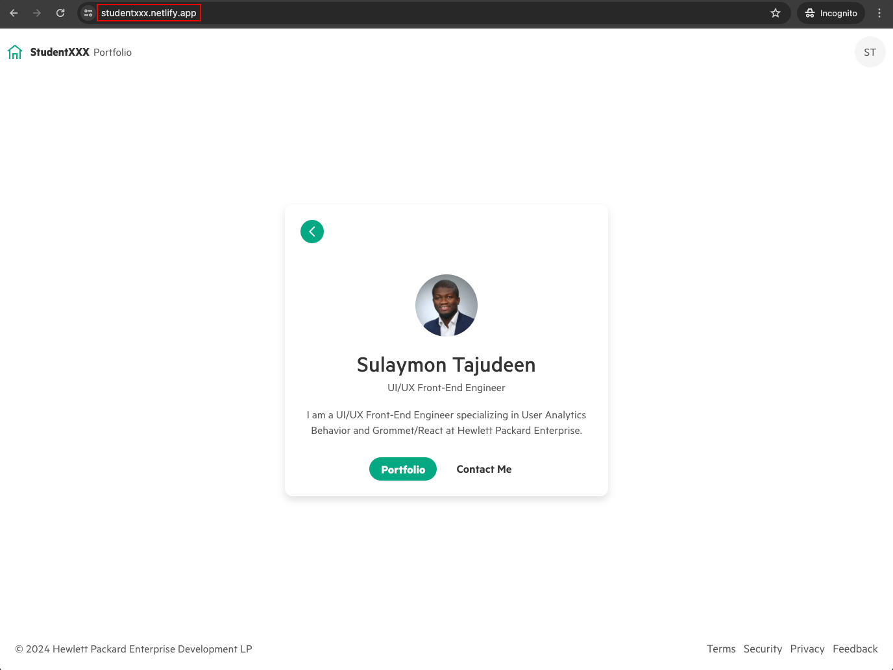

# Welcome to the HPE Developer Hack Shack

[HPE Developer Community Team](https://hpedev.io)

  

# Workshops on Demand

# Introduction to Grommet and Grommet Designer hands-on workshop

# Author: [Sulaymon Tajudeen](mailto:sulaymon.tajudeen@hpe.com)

<small>This course was originally created by [Pramod Reddy](mailto:pramod-reddy.sareddy@hpe.com)</small>

**Grommet** is an open-source React component library that provides responsive and accessible mobile-first UI components for building a consistent enterprise level applications and weekend side projects :-)

Get up to speed with Grommet UI library using the following links.

1. [Grommet](https://v2.grommet.io) website for more information about Grommet components.
2. [Grommet Designer](https://designer.grommet.io/) is a visual tool for UI/UX designers and developers to create webpages using Grommet components.

This workshop focuses on how developers/designers can use Grommet component library and Grommet Designer to quickly design/develop their web applications, generate Grommet code from the design, push the source code to GitHub and deploy it on Netlify.

You will get started by building a simple bio page using Grommet Designer. No worries, if this is your first exposure to Grommet and Grommet Designer, we will take you through, step by step, and, by the end of the this short introductory course, you'll be deploying your own bio page web application in Netlify that can be viewed from the internet anytime from anywhere around the globe.

## Documentation and Tools

All you need is a laptop or workstation with a chrome/edge/firefox/safari browser and internet connection.

We will use Grommet designer to design the application and install nodejs, yarn, and git on your workstation to run the application locally. We will then push the code to GitHub repo and deploy it on Netlify to access it from the internet.

Visit below links to find more information about Grommet and Grommet Designer.

- Visit [Grommet Components](https://v2.grommet.io/components) website to lean more about Grommet components.
- Visit the [Grommet Storybook](https://storybook.grommet.io/) website for examples of Grommet components.
- Visit the [Grommet Code Sandbox](https://codesandbox.io/u/grommetux/sandboxes) website for Grommet sandboxes.
- Visit [HPE Design System](https://design-system.hpe.design) website for designers and developers to explore guidance and recommendations when building UI with Grommet especially for HPE products.

## Lab Goals

At the end of the workshop, you will be able to

- Explain what is Grommet?
- Explain why it is used?
- Create/design your own web application using [Grommet Designer](https://designer.grommet.io/)
- Generate the source code (Grommet components) from the design
- Push the source code to GitHub
- Deploy the source code from GitHub to Netlify and access your new site from the internet

## Lab Flow

HPE Developer Workshops-on-Demand are delivered through a central point that allows a portable, dynamic version of the lab guides. We are now leveraging a jupyterhub server on which all the different labs guides will be stored in a Notebook format (\*.ipynb). These Notebooks are accessible from the internet for the event.

Besides, the notebooks can be downloaded on to your own laptop for further usage or edition. In order to use them, you will need to install the jupyter notebook application using [jupyter notebook download link](https://jupyter.org/install).
Beginner's guide available on [jupyter notebook website](https://jupyter-notebook-beginner-guide.readthedocs.io/en/latest/what_is_jupyter.html)

In a nutshell, a notebook works as follows:

• A Notebook is a series of cells

• Notebook uses a kernel (visible in the upper right corner of the Notebook)

• Cell can be Markdown or Code (in the selected kernel)

• To Run a cell use:

    o The Play Button at the top
    o Ctrl-Enter (run and stay on same cell)
    o Shift-Enter (run and move to next cell)

• Running a markdown cell is just rendering it

• Running a Code cell runs the code and display the output just below the cell

• When a cell is running it displays a [*] to its left, then when finished, it displays a counter of the number of execution of that cell

• You cannot run a cell when another is already running but you can interrupt a running cell with the stop button

Happy labs! :-)

## The hands-on lab exercises have been designed to be completed in the order below:

### Lab 1: Introduction

In this introduction, we will learn about what is Grommet and Grommet designer? How it will be helpful in designing and developing a web application.

- Lab link - [Lab 1](1-WKSHP-Introduction.ipynb)

### Lab 2: Build/design your application in Grommet Designer

In this lab, we will use Grommet Designer to design the bio page site and apply different themes like HPE, Grommet, etc and appearance modes like Dark and Light.

- Lab link - [Lab 2](2-WKSHP-DesignApp.ipynb)

### Lab 3: Prepare Environment

In this lab, we will prepare the local environment by installing nodejs, yarn, and git to run the web application locally and push the code to GitHub repository.

- Lab link - [Lab 3](3-WKSHP-PrepareEnvironment.ipynb)

### Lab 4: Deploy your App to Netlify

In this lab, we will connect GitHub repo to Netlify to deploy the application we built with Grommet Designer and access it from the internet.

- Lab link - [Lab 4](4-WKSHP-DeploytoNetlify.ipynb)

## Thank You!

