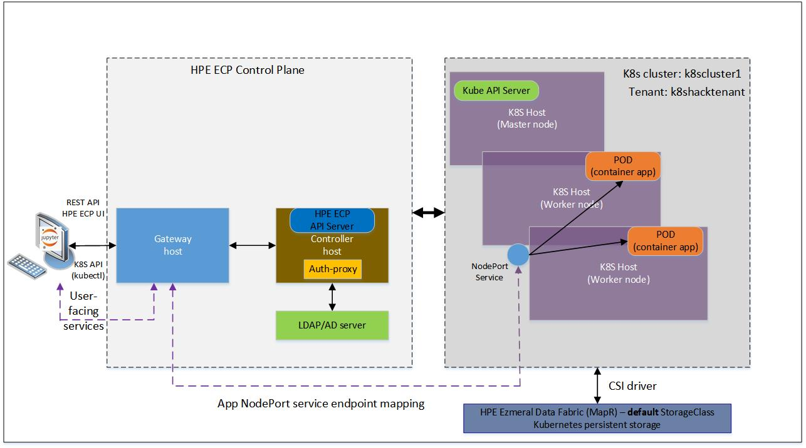

# Welcome to Hack Shack
Powered by [HPE DEV Team](https://hpedev.io)

# HPE DEV Workshops-on-Demand

# Introduction to the HPE Ezmeral Container Platform REST API 

*Version: HPE Ezmeral Container Platform 5.3 (or later)*

In this workshop, you will learn how developers can interact with HPE Ezmeral Container Platform (HPE ECP) programmatically through its REST API to accelerate their application development and deployment on containers. The workshops does not cover how to perform IT administrative tasks through the REST API.

# Author: [Denis Choukroun](mailto:denis.choukroun@hpe.com)

  
  

## Handouts
HackShack Workshops are delivered through a central point that allows a portable, dynamic version of the lab guides. Rather than using standard PDF files which always end in copy / paste errors from the lab guide into the TS sessions, this year we decided to innovate and introduce a brand-new infrastructure. We will leverage a JupyterHub server on which all the different lab guides will be stored in a notebook format (*.ipynb).

You can freely copy the Jupyter Notebooks, including their output, in order to practice back at your office at your own pace, leveraging a local installation of Jupyter Notebook on your laptop.
- You install the Jupyter Notebook application from [here](https://jupyter.org/install). 
- A Beginners Guide is also available [here](https://jupyter-notebook-beginner-guide.readthedocs.io/en/latest/what_is_jupyter.html)

Enjoy the labs ! :-)

## Lab flow
HPE Ezmeral Container Platform (HPE ECP) uses **container technology** to make it simpler and more cost-effective to deploy, run and manage both cloud native microservices enterprise workloads and non-cloud native monolithic stateful applications for machine learning, deep learning, and big data analytics use cases.

You will start you off with some fundamental knowledge about how to interact with the HPE Ezmeral Container Platform programmatically through its REST API. As a tenant user, you will learn how to perform authentication, deploy cloud native stateless applications and non-cloud native distributed multi-node applications for AI/ML and data analytics, and interpret/respond to the status of your REST API calls. We will walk you through the process, step by step. By the end of the session, you'll be deploying a TensorFlow application framework and other simple applications.

## Documentation
The REST API documentation for HPE Ezmeral Container Platform is accessible from an HPE Ezmeral Container Platform deployment.

The documentation for HPE Ezmeral Container Platform is accessible on-line [here](https://docs.containerplatform.hpe.com/).  

Find out more about the open source KubeDirector project [here](https://kubedirector.io/).

# Lab environment - A high level overview of the physical architecture of the HPE Ezmeral Container Platform deployment
This high-level architecture diagram depicts how you can interact programmatically with the HPE Ezmeral Container Platform. 
    

      

Our HPE Controller Platform deployment is comprised of a number of components:
1. The `Controller host` manages all the hosts that comprise the HPE Ezmeral Container Platform deployment.
2. The `Kubernetes (K8s) hosts` are under the direct control of the Controller host. These hosts can be grouped into one or more distinct Kubernetes clusters that run containerized applications.
3. The `Gateway host` acts as a proxy server that carries client requests like HPE ECP UI, REST API, K8s API (kubectl commands), to the HPE Ezmeral Container Platform controller, to one of the K8s clusters, or to the containerized application services running in one of the K8s clusters. Containerized application service endpoints are exposed outside the Kubernetes cluster to users via the gateway re-mapped ports. 
4. The `Authentication Proxy` handles user authentication and forwards authenticated K8s API traffic (kubectl commands) to the Kubernetes cluster master and returns any responses to the request back to the user.
5. The pre-integrated `HPE Ezmeral Data Fabric` (a MapR File System) is a storage provider for persistent volumes for the applications that require persistence of data. The default StorageClass is available out of the box from the HPE Ezmeral Data Fabric (formerly MapR Data Platform) using the HPE Container Storage Interface (CSI) driver for MapR. HPE Ezmeral Data Fabric also provides shared persistent container storage.

# Workflow

## Lab 1: Intro and authentication to the REST API
In this intro, you will connect to the HPE ECP REST API endpoint and retrieve an authentication session token to be used for subsequent REST API requests.

* [Lab 1](1-WKSHP-HPECP-IntroAndAuth.ipynb)

## Lab 2: Deploying cloud native and non-cloud native applications programmatically as tenant users
Continuing with our lab series, this lab will walk you through how you, as a tenant user, can use the REST API and K8s API to deploy containerized stateless and stateful applications on a Kubernetes cluster managed by the HPE Ezmeral Container Platform. You will use kubectl (K8s API client) to interact directly with the Kubernetes cluster in the context of your tenant user.

* [Lab 2](2-WKSHP-HPECP-DeployApp-K8S-Tenant-tf.ipynb)

# Join the HPE DEV Community

# Thank you!

