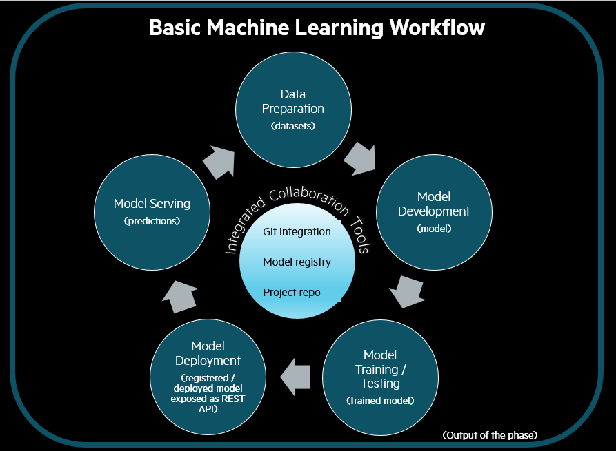
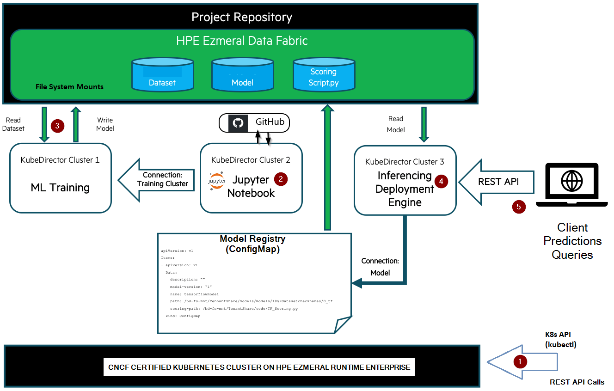

# Welcome to Hack Shack
[HPE Developer Community Team](https://hpedev.io)

# HPE Developer Workshop


# Deploying end-to-end machine learning workflows with HPE Ezmeral ML Ops

*Version: HPE Ezmeral ML Ops built on HPE Ezmeral Runtime Enterprise 5.4+*

[HPE Ezmeral ML Ops](https://www.hpe.com/us/en/solutions/machine-learning-operations.html) is a container-based software platform for organizations that want to operationalize the machine learning (ML) workflow process for delivering ML models to production with ease. HPE Ezmeral ML Ops extends the capabilities of the HPE Ezmeral Runtime Enterprise (formerly known as HPE Ezmeral Container Platform), enabling the data science teams to run all their ML tasks **in a single platform**, using the underlying HPE Ezmeral Runtime Enterprise, Kubernetes and [KubeDirector](https://kubedirector.io/) an open source application from HPE. With HPE Ezmeral ML Ops, data science teams can quickly spin up, &mdash; **on-demand** &mdash;, their development environment, develop and experiment several models with the analytic toolkits of their choice, perform parameters optimization and train their models against enterprise production data. HPE Ezmeral ML Ops is also for Operations teams who are tasked to deploy trained ML models artifacts &mdash; handed over by data scientists &mdash; into production by creating a secure RESTful API service layer to serve the model as a prediction service, so it can be consumed by application clients to draw predictions on new data points.

In this workshop, using an example related to predicting taxi ride travel times in NY City, you will be looking at the steps to build an **ML pipeline** that implements a basic end-to-end data science machine learning workflow process and that brings models to production. All of this in a single platform: **HPE Ezmeral ML Ops**.  

# Authors: [Sandeep Deshmukh](mailto:sandeep.deshmukh@hpe.com), [Denis Choukroun](mailto:denis.choukroun@hpe.com)

<p align="center">
  
  
</p>

## Handouts
HPE Developer Workshops-on-Demand are delivered through a central point that allows a portable, dynamic version of the lab guides. Rather than using standard PDF files which always end in copy / paste errors from the lab guide into the TS sessions, this year we decided to innovate and introduce a brand-new infrastructure. We will leverage a JupyterHub server on which all the different lab guides will be stored in a notebook format (*.ipynb).

You can freely copy the Jupyter Notebooks, including their output, in order to practice back at your office at your own pace, leveraging a local installation of Jupyter Notebook on your laptop.
- You install the Jupyter Notebook application from [here](https://jupyter.org/install). 
- A Beginners Guide is also available [here](https://jupyter-notebook-beginner-guide.readthedocs.io/en/latest/what_is_jupyter.html)

## A quick look at Jupyter Notebook
Jupyter Notebook is an open source solution for interactive documents that are commonly used to hold code for ML/DL models. 
A Notebook consists of cells. A cell can be a markdown cell (contains comments, text, images) or a code cell. 

To execute code within the Notebook, you run each cell in turn by clicking on the ***Play button*** in the menu bar of the Notebook.

> **Note:**  When you see a [*] next to the action it means your execution step is busy working within the notebook. When you see a digit number, it means the execution of the step is completed.  


Enjoy the labs ! :-)


## Lab flow

Imagine you have been tasked to create an application or a service that can predict travel times for a taxi ride in New York City, based on the 2019 New York City yellow cab trip dataset. To create this prediction service, you will build a specific type of infrastructure known as **machine learning pipeline** that streamlines the end-to-end data science machine learning workflow process, from data preparation, model development and training to model deployment in production using **HPE Ezmeral ML Ops**.

>**Note:** _This workshop is not intended to teach you about AI/ML. It is intended to give a use case for data science end-to-end ML workflow with HPE Ezmeral ML Ops._

## Technical Documentation
The technical documentation for HPE Ezmeral MLOps is accessible on-line [here](https://docs.containerplatform.hpe.com/54/reference/HPE_Ezmeral_ML_Ops.html).  

# Lab Workflow

**A basic Machine Learning (ML) workflow** shown in the picture below, defines the sequential and repeatable steps of the machine learning process for delivering an ML model to production. The workflow typically consists of data preparation, model development, model training and testing, model deployment and model serving. These sequential steps can be implemented by _a specific type of infrastructure_ known as **_machine learning pipeline_** that streamlines and standardizes the machine learning process and enables data science teams to continue this process **repeatedly** as new and more recent datasets come in.    
**Enter HPE Ezmeral ML Ops!**    

<center></center>

The diagram below depicts the ML Ops applications and the components that come together to build the ML pipeline over Kubernetes cluster via HPE Ezmeral ML Ops. It also describes the sequence of steps you will follow during this workshop to build the ML pipeline that ties together these components. 

>**Note:** _In this workshop, you will use a programmatic access through API calls to build the ML Pipeline over Kubernetes. Note that when using the HPE Ezmeral ML Ops Graphical User Interface (GUI), the exact same sequence of steps will apply._ 

The ML pipeline consists of:



* **A CNCF certified Kubernetes cluster** deployed on on HPE Ezmeral Runtime Enterprise (formerly known as HPE Ezmeral Container Platform) with _multitenancy_ support and _AD/LDAP_ integration.
* **A set of ML Ops applications:** 
    * **A local (lightweight) Jupyter Notebook cluster** used by data scientists as a code sandbox to develop and test their models. Users can directly login to their local Jupyter Notebook server using their HPE Ezmeral ML Ops login credentials. 
    * **A training cluster** with large compute capacity (ideally with GPUs). Data scientists can submit the code they developed in their local Jupyter Notebook to a **shared** training cluster remotely. The training cluster offers a large scaled computing environment to data scientists to train their full ML models on, in a reasonable time, typically against a larger dataset.
    * **An inferencing deployment engine cluster** that exposes a secure and scalable RESTful API endpoint service that is used to serve the trained model as a prediction service.
* **A set of integrated collaboration tools.** HPE Ezmeral ML Ops includes source control, project repository and model registry capabilities that organizations can utilize to standardize their ML workflows on a single platform and enhance collaboration among data science team and Operations team:
    * **A Version Control System (VCS)** integrated into Jupyter Notebook ML Ops application. HPE Ezmeral ML Ops integrates with Git web-based version control systems such as GitHub or Bitbucket for implementation of source code control. Data scientists can maintain versioning of their model codes, commit codes to the VCS right from their Jupyter Notebook and collaborate with each other.
    * **A central project repository** used to share training data and trained models between containers, and eliminating local copies of ML pipeline datasets and code. The NFS File System Mount (FSMount) features of HPE Ezmeral ML Ops is used to access the pre-integrated HPE Ezmeral Data Fabric for **shared** file system storage. The shared file system storage is mounted as an NFS File System mount point to **all** ML Ops application containers on a per-tenant basis. In our use case, by leveraging the pre-integrated HPE Ezmeral Data Fabric, HPE Ezmeral ML Ops makes it possible to store centrally and share the key data components (datasets, ML models and scoring scripts) across the ML Ops application components of the ML pipeline.
    * **A model registry** used to store metadata information and versions about the trained models within HPE Ezmeral ML Ops.


### **Let's get hands on!**

## Lab 1: Authenticate as tenant user to HPE Ezmeral ML Ops using REST API calls
In this first lab, you will connect to the HPE Ezmeral ML Ops REST API endpoint and retrieve an authentication session token to be used for fetching the KubeConfig file you will need to interact with the Kubernetes cluster available for your tenant.

* [Lab 1](1-WKSHP-MLOps-K8s-Auth-Get-Kubeconfig.ipynb)


## Lab 2: Deploy a local Jupyter Notebook sandbox on HPE Ezmeral ML Ops
In this lab, you will deploy a local Jupyter Notebook cluster as a component of the ML pipeline. Data scientists typically use Jupyter Notebook as a code sandbox for model development, experimentation of various ML algorithms and parameters tuning to get the best performing prediction model.

* [Lab 2](2-WKSHP-MLOps-K8s-Deploy-Local-Notebook.ipynb)

## Lab 3: Model training
In this lab, you will connect to your local Jupyter Notebook sandbox Web UI and use it to train the model on a dataset. You will interact with a **tenant-shared training cluster** that offers more resources than your local Jupyter Notebook to submit your code and train your model faster. For this lab, the training cluster component of the ML pipeline has already been deployed by the Operations team for your tenant on HPE Ezmeral ML Ops. The output of this step is the trained model saved to a file on the central project repository.      

## Lab 4: Model deployment: delivering the trained model to production
In this lab, you will register your trained model within HPE Ezmeral ML Ops model registry. You will then create a deployment engine cluster as a component of the ML pipeline to serve your registered model as a secure RESTful API prediction service. So, the model can be consumed by application clients to draw predictions on new input data (that is real-world data). 3rd party tools, for example Prometheus and Grafana, could also be used for model monitoring and for detection of model performance degradation (aka model drift: the accuracy of the predictions starts to decrease) in production that may potentially invoke a new iteration in the ML workflow process on a new sets of data. 

>**Note:** _Model drift monitoring is out of scope of this workshop._ 

* [Lab 4](4-WKSHP-MLOps-K8s-Register-Model-Deployment.ipynb)

## Lab 5: Model serving: Serving prediction queries
Finally, using cURL as an HTTP application client, you will consume your model to make prediction using RESTful API calls to the deployed API prediction service.

* [Lab 5](5-WKSHP-MLOps-K8s-Model-Serving.ipynb)


## Join the HPE DEV Community


# Thank you!


```python

```
