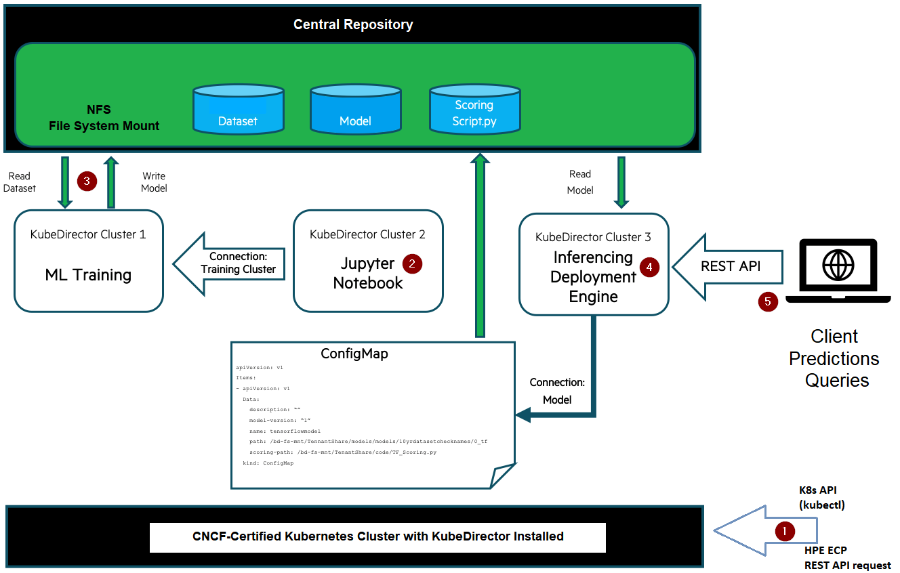

# Welcome to Hack Shack
[HPE Developer Community Team](https://hpedev.io)

# HPE Developer Workshop

# Building a dynamic machine learning pipeline with KubeDirector

*Version: KubeDirector v0.9.0+*

In this workshop, you will learn the steps to create an end-to-end machine learning (ML) pipeline, from data preparation to model deployment through model training and registry, using Kubernetes and another open source application, called [**KubeDirector**](https://github.com/bluek8s/kubedirector/wiki), on a [CNCF-certified Kubernetes cluster](https://www.cncf.io/certification/software-conformance/). You will learn how the key use of KubeDirector applications, KubeDirector clusters and a new capability, called **_Connections_** that enables a **dynamic** ML pipeline.
 

# Author: [Denis Choukroun](mailto:denis.choukroun@hpe.com)

  
  

## Handouts
HPE Developer Workshops-on-Demand are delivered through a central point that allows a portable, dynamic version of the lab guides. Rather than using standard PDF files, which always end in copy/paste errors from the lab guide into the TS sessions, we are leveraging a JupyterHub server where the lab guides are stored in a notebook format (*.ipynb).

You can freely copy the Jupyter Notebooks, including their output, in order to practice back at your office at your own pace, leveraging a local installation of Jupyter Notebook on your laptop.
- You install the Jupyter Notebook application from [here](https://jupyter.org/install). 
- A Beginners Guide is also available [here](https://jupyter-notebook-beginner-guide.readthedocs.io/en/latest/what_is_jupyter.html).

## A quick look at Jupyter Notebook
Jupyter Notebook is an open source solution for interactive documents that are commonly used to hold code for ML/DL models. 
A Notebook consists of cells. A cell can be a markdown cell (contains comments, text, images) or a code cell. 

To execute code within the Notebook, you run each cell in turn by clicking on the ***Play button*** in the menu bar of the Notebook.

> **Note:**  When you see a [*] next to the action it means your execution step is busy working within the notebook. When you see a digit number, it means the execution of the step is completed.  

Enjoy the labs ! :-)

## Lab flow

In this lab, we will explore how to create and control a machine learning pipeline using KubeDirector running on a CNCF-certified Kubernetes cluster through the use of a specific use case. In the use case, you’ll imagine that you have been tasked to create an application or service that can predict travel times for a taxi ride in New York City, based on a provided dataset. You’ll create this prediction service by tying together different pieces of the machine learning process in a dynamic ML pipeline using KubeDirector. 

>Note: For this workshop, the Kubernetes cluster is managed by [HPE Ezmeral Runtime Enterprise](https://www.hpe.com/us/en/software/ezmeral-runtime.html) (formerly known as HPE Ezmeral Container Platform). This turnkey enterprise-grade container platform provides the ability to deploy and manage both cloud-native and non-cloud native applications using open source Kubernetes. It does so with **multi-tenant** container isolation and pre-integrated [HPE Ezmeral Data Fabric](https://www.hpe.com/us/en/software/data-fabric.html) for **shared** persistent storage for application containers.

## Documentation
Recommended reading: [Building Dynamic Machine Learning Pipelines with KubeDirector](https://developer.hpe.com/blog/building-dynamic-machine-learning-pipelines-with-kubedirector) 

Find out more about the _KubeDirector_ open source project [here](https://kubedirector.io).

The documentation for HPE Ezmeral Runtime Enterprise is accessible on-line [here](https://docs.containerplatform.hpe.com). 

# Workflow

**ML pipeline:** The process of tying together different pieces of the machine learning process is known as a machine learning (ML) pipeline. 

The diagram below depicts the components that come together to build the ML pipeline. It also describes the steps you will follow during this workshop to build the ML pipeline that ties together these components. 

* **A CNCF-certified Kubernetes cluster with KubeDirector (v0.9.0+)** installed with the KubeDirector applications for machine learning pipeline registered (training engine, jupyter notebook, deployment engine). For this workshop, the Kubernetes cluster is managed by HPE Ezmeral Runtime Enterprise.
* **A local (lightweight) Jupyter Notebook KubeDirector cluster** used by data scientists as a code sandbox to develop, train and test their models.
* **A tenant-shared training KubeDirector cluster** with large compute capacity (ideally with GPUs). Data scientists can interact with remote larger capacity training cluster to train their models faster.
* **A model registry**. A ConfigMap resource is used to store metadata about the trained model in the Kubernetes cluster.
* **An inferencing deployment engine KubeDirector cluster** running on the Kubernetes cluster to serve the trained model as a prediction service.
* **A central repository** used to share data between containers. An NFS can be used to share data between containers. In this workshop, the NFS File System Mount (FSMount) features of HPE Ezmeral Ezmeral Runtime Enterprise is used to access the pre-integrated HPE Ezmeral Data Fabric for shared file system. The shared file system storage is mounted as an NFS File System mount point to **all** application containers on a per-tenant basis. In our use case, this type of storage is used to store and share, between containers, the key data components needed in the ML pipeline, such as the input dataset, trained ML models, and the scoring script used to make predictions on new data. 

## Lab 1: Authenticate as tenant user to the Kubernetes cluster using REST API calls
In this first lab, you will authenticate to the Kubernetes cluster managed by HPE Ezmeral Runtime Enterprise. You will then fetch the KubeConfig file you will need to interact with the Kubernetes cluster available for your tenant.

* [Lab 1](1-WKSHP-K8s-ML-Pipeline-Auth-Get-Kubeconfig.ipynb)

## Lab 2: Deploy a local Jupyter Notebook cluster to interact with a tenant-shared training cluster
In this lab, you will use kubectl (K8s API client) to interact directly with the Kubernetes cluster in the context of your tenant user in order to deploy a local Jupyter Notebook cluster using KubeDirector. 

* [Lab 2](2-WKSHP-K8s-ML-Pipeline-Deploy-Local-Notebook.ipynb)

## Lab 3: Train your model on a tenant-shared training cluster
In this lab, you will connect to your local Jupyter Notebook cluster Web UI and use it as a code sanbox to build, train and test the model on a dataset. You will interact with a tenant-shared training cluster that offers more resources than your local Jupyter Notebook to train your model faster. For this lab, the training KubeDirector cluster has already been deployed by the tenant administrator.  

## Lab 4: Move the trained model to production: register and deploy the trained model
In this lab, you will first register your model in the Kubernetes cluster. Then using KubeDirector, you will deploy your trained model on an inference deployment engine cluster to serve the model as a prediction service. 

* [Lab 4](4-WKSHP-K8s-ML-Pipeline-Register-Model-Deployment.ipynb)

## Lab 5: Serving prediction queries
Using cURL as an HTTP client, you will make prediction queries to your prediction service.

* [Lab 5](5-WKSHP-K8s-ML-Pipeline-Model-Serving.ipynb)

## Lab 6: Exploring the Dynamic aspect of the ML pipeline
Finally, you will explore the dynamic aspect of your ML pipeline. 

* [Lab 6](6-WKSHP-K8s-ML-Pipeline-Dynamic-Aspect.ipynb)

## Join the HPE DEV Community

# Thank you!

