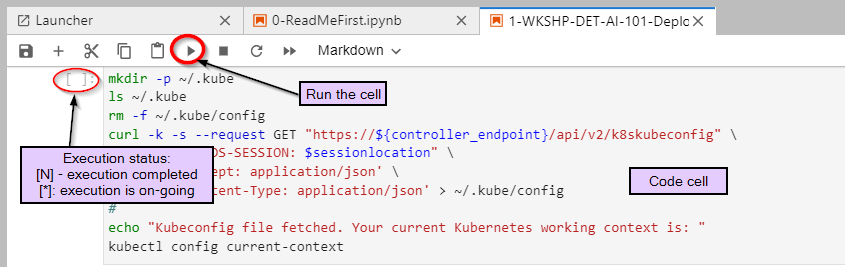

# Welcome to the WoD Developer Hack Shack
[WoD Developer Community Team](https://wod.io)

  

# Workshops on Demand

# Introduction to Understanding LLMs and Their Value
In this workshop, we'll explore the fundamentals of Large Language Models (LLMs)—their definition, structure, and practical applications—using real examples demonstrated with HPE's open-source library, LL-Mesh.

# Author: [Antonio Fin](mailto:antonio.fin@hpe.com)

## Handouts
You are welcome to copy the Jupyter Notebooks, including their outputs, to practice at your own pace back at your office using a local installation of Jupyter Notebook on your laptop.

- Install the Jupyter Notebook application from [here](https://jupyter.org/install).
- A beginner's guide is available [here](https://jupyter-notebook-beginner-guide.readthedocs.io/en/latest/what_is_jupyter.html).

## Lab Flow
WoD Developer Workshops-on-Demand are delivered through a centralized platform that provides a portable, dynamic version of the lab guides. Instead of using standard PDF files—which often lead to copy/paste errors during lab sessions—we have innovated with a brand-new infrastructure. We leverage a JupyterHub server where all the lab guides are stored in notebook format (*.ipynb).

In a nutshell, a notebook works as follows:

- A notebook is a series of cells.
- Notebooks use a kernel (visible in the upper right corner).
- Cells can be either Markdown or code (in the selected kernel).
- To run a cell, you can:
  - Click the Play button at the top.
  - Press **Ctrl+Enter** (run and stay on the same cell).
  - Press **Shift+Enter** (run and move to the next cell).
- Running a Markdown cell renders it.
- Running a code cell executes the code and displays the output just below the cell.
- When a cell is running, it displays a `[*]` to its left; when finished, it shows an execution count.
- You cannot run a cell while another is already running, but you can interrupt a running cell with the Stop button.

  

Enjoy the labs! 😊

## Workflow

### Lab 1: LLM Basics
**Description:** In this section, we'll explore the fundamentals of Large Language Models (LLMs)—their definition, structure, and practical usage—using real examples demonstrated with HPE's open-source library, LLM Agentic Tool Mesh.

- [Lab 1](1-WKSHP-LLM_Basics.ipynb)

### Lab 2: LLM Agentic Tool Mesh Overview
**Description:** In this lab, we'll explore the challenges of adopting Generative AI technologies and discuss how the LLM Agentic Tool Mesh platform provides effective solutions to overcome them.

- [Lab 2](2-WKSHP-LLMesh_Overview.ipynb)

### Lab 3: Building a Chatbot with LLM Agentic Tool Mesh
**Description:** In this lab, we'll provide examples of creating a chat application by concatenating prompts, models, and memories using LLM Agentic Tool Mesh.

- [Lab 3](3-WKSHP-LLM_Chat.ipynb)

### Lab 4: Retrieval-Augmented Generation (RAG)

**Description:** This lab offers examples of a RAG application, starting from extracting data from a document, transforming it, and loading it into a vector store for retrieval.

- [Lab 4](4-WKSHP-LLM_RAG.ipynb)

### Lab 5: Multi-Agent Systems

**Description:** Explore the concept of multi-agent systems and how they can be implemented using LLM Agentic Tool Mesh.

- [Lab 5](5-WKSHP-LLM_MultiAgent.ipynb)

### Lab 6: LLM Agentic Tool Mesh Web Apps Showcase

**Description:** This lab showcases some example web applications that are available in the LLM Agentic Tool Mesh repository.

- [Lab 6](6-WKSHP-LLM_WebApps.ipynb)

# Thank You!

  

