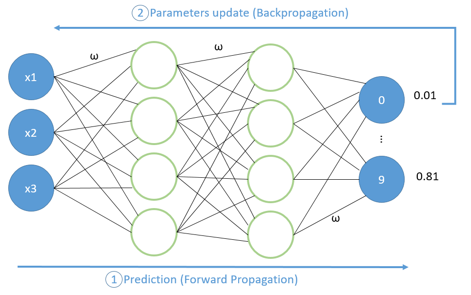
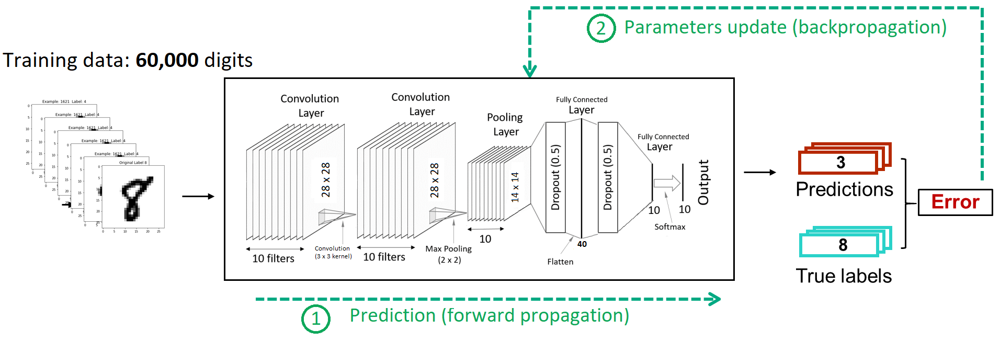

# Welcome to the HPE Developer Hack Shack
[HPE Developer Community Team](https://hpedev.io)

  
  

# HPE Developer Workshop

# Introduction to AI 101 - Convolutional neural network (CNN) for MNIST
In this workshop, you will assume the role of a data scientist who has been tasked to develop a ML model for (doing/learning/teaching something…bla bla bla). Data scientists typically uses Jupyter Notebook server as a code sandbox for model development and tuning. You will use the HPE Ezmeral ML Ops software, a container-based solution for machine learning (ML) workflow management from HPE, to deploy your local Jupyter Notebook server and learn how to develop and tune a convolutional neural network model that yields to the best prediction result. 

# Authors: [Hana Malha](mailto:Hana.malha@hpe.com) -  [Denis Choukroun](mailto:denis.Choukroun@hpe.com)

## Handouts
You can freely copy the Jupyter Notebooks, including their output, in order to practice back at your office at your own pace, leveraging a local installation of Jupyter Notebook on your laptop.
- You install the Jupyter Notebook application from [here](https://jupyter.org/install). 
- A Beginners Guide is also available [here](https://jupyter-notebook-beginner-guide.readthedocs.io/en/latest/what_is_jupyter.html)

## Lab flow
HPE Developer Workshops-on-Demand are delivered through a central point that allows a portable, dynamic version of the lab guides. Rather than using standard PDF files which always end in copy / paste errors from the lab guide into the TS sessions, this year we decided to innovate and introduce a brand-new infrastructure. We will leverage a JupyterHub server on which all the different lab guides will be stored in a notebook format (*.ipynb).

## A quick look at Jupyter Notebook
Jupyter Notebook is an open source solution for interactive documents that are commonly used to hold code for ML/DL models. 
A Notebook consists of cells. A cell can be a markdown cell (contains comments, text, images) or a code cell. 

To execute code within the Notebook, you run each cell in turn by clicking on the ***Play button*** in the menu bar of the Notebook.

> **Note:**  When you see a [*] next to the action it means your execution step is busy working within the notebook. When you see a digit number, it means the execution of the step is completed.  

In a nutshell, a notebook works as follows:

• A Notebook is a series de cells

• Notebook uses a kernel (visible in the upper right corner of the Notebook)

• Cell can be Markdown or Code (in the selected kernel)

• To Run a cell use:

    o The Play Button at the top
    o Ctrl-Enter (run and stay on same cell)
    o Shift-Enter (run and move to next cell)
    
• Running a markdown cell is just rendering it

• Running a Code cell runs the code and display the output just below the cell

• When a cell is running it displays a [*] to its left, then when finished, it displays a counter of the number of execution of that cell

• You cannot run a cell when another is already running but you can interrupt a running cell with the stop button

Enjoy the labs ! :-)

<h1>
Introduction to AI 101 Convolutional neuronal network for MNIST
</h1>
In this lab you will train a simple Convolutional Neural Network (CNN) to recognize handwritten digits. The dataset you will use is called MNIST(Modified National Institute of Standards and Technology databaset), with 70.000 digits pictures. 
After being trained, the CNN will be able to 'read' the values written on those pictures. The network will classify the pictures into a digit class going from '0' to '9'. This is what we refer to as 'CNN prediction'.The prediction accuracy can then reach up to 99% of images being properly classified. This value will depend on the training conditions you will get familiar with while doing this lab, though.

We will provide a proposal of a neural network architecture, for you to focus on understanding the training process. Then you will have free space to question our choices and build your first own CNN to achieve a higher score than we did.

### Deep Neural Networks
Neural netwoks are composed of successive layers of neurons. Each neuron performs a **weighted sum** on the information coming from its previous layer, then applies an activation function to it. This **activation function** is a kind of threshold that decides how information is to be transferred to the next layer.
You can note that the weights used for the sum are parameters that are learned by network to improve its prediction quality.

Learning the weights is done through the training of the neural network. The training computes an error function comparing the prediction of a digit and its verified value also called 'image label'. We talk about  **forward propagation**. 

This error function is minimized throughout the learning process with the help of the gradient descent algorithm. Gradient values are used to update the weights and tune them to get closer to the correct prediction on the training data. We talk about **backpropagation**.

### Convolutional Neural Network

CNN are a type of neural networks that rely on the convolution operation. Convolution can be described as a **moving element-wise product** between a small filter/kernel (in yellow) and a bigger input matrix (MNIST digit image for example).

When training a CNN, its parameters/weights, including the kernel parameters, are updated through forward and backpropagation. It follows the same training process as the Dense neural networks introduced earlier.

(For more details about how the training works, you can refer to the following [link](https://mattmazur.com/2015/03/17/a-step-by-step-backpropagation-example/).)

The 70.000 images of the MNIST dataset will be split into two parts, training and test data. Only 60.000 images will be used for the training and the rest will serve as validation/test set.

### A dive into a data scientist work 

The hands-on section will follow 3 main steps:

  - **Prepare the groundwork**
  
  After importing the necessary dependencies, you will learn about what neural networks hyperparameters are, and what values we chose to assign to them. You will also perform a couple of transformations on the dataset to have it ready for the training.
      
    
  - **Build and train your model**
  
  You will create a CNN based on architectural choices we made for you. You will be able to train the model and visualize some important metrics that guide a data scientist during the development cycle. Take the time to get familiar with the learning process that is common to different types of neural networks.
   
   
  - **Evaluate and enhance the model**
 
 After visualizing the predictions made by the model on some handwritten digit images, you will have the opportunity to adjust the neural network and get better predictions. For this, you can tune the hyperparameters and the architecture of the neural network to increase its accuracy.

Start the labs by clicking on the link below !

* [AI101-CNN](1-WKSHP-AI-101-Deploy-Local-Notebook.ipynb)

# Thank you!

