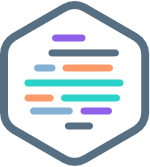

##       

# Welcome to the HPE DEV Hack Shack
[WoD Developer Community Team](https://wod.io)

# WoD Developer Workshop

# Introduction to Podman 201
In this workshop, we’ll explain and use some deeper concepts of how Podman works, going deeper into networking, storage and security. We will also explain how Podman can be used as a development and/or testint environments for workloads that then will be deployes into a kubernetes cluster. We will use OpenShift which is Red Hat's kubernetes based platform.

Remember to go through the Podman 101 workshop to understand the basic concepts that we'll cover during this workshop.

# Authors:   [Pablo Preciado](mailto:ppreciad@redhat.com) & [Frederic Passeron](mailto:frederic.passeron@hpe.com)

## Handouts
You can freely copy the Jupyter Notebooks, including their output, in order to practice back at your office at your own pace, leveraging a local installation of Jupyter Notebook on your laptop.
- You install the Jupyter Notebook application from [here](https://jupyter.org/install). 
- A Beginners Guide is also available [here](https://jupyter-notebook-beginner-guide.readthedocs.io/en/latest/what_is_jupyter.html)

## Objectives of the Podman201 Lab
At the end of the lab, students should be able to manage Podman networks, volumes, pods and Quadlets. Students should also learn the core concepts used for deploying applications to kubernetes and understand how Podman and kubernetes integrate with each other.

This lab is intended to support a trial and error method so that, during the session, students should fully understand what is behind the tool. Blindly following instructions is not an effective way to learn, IMHO. You've been warned ;-)

Expected duration : 120 minutes

## Reference documents
This workshop is intended to be an introduction to advanced concepts of Podman, for a detailed explanation on the funtinality please use Podman documentation: https://docs.podman.io

Also, for the OpenShift cluster you can review it's documentation: https://access.redhat.com/documentation/en-us/openshift_container_platform

At the start of each section, there is an estimate of how long it will take to complete.

## Lab flow
The WoD Developer Workshops-on-Demand are delivered through a central point that allows a portable, dynamic version of the lab guides. Rather than using standard PDF files, which always end in copy / paste errors from the lab guide into the TS sessions, this year we decided to innovate and introduce a brand-new infrastructure. We will leverage a JupyterHub server on which all the different lab guides will be stored in a notebook format (*.ipynb).

In a nutshell, a notebook works as follows:

• A notebook is a series of cells

• The notebook uses a kernel (visible in the upper right corner of the notebook)

• A cell can be markdown or code (in the selected kernel)

• To run a cell, use:

    o The Play Button at the top
    o Ctrl-Enter (run and stay on same cell)
    o Shift-Enter (run and move to next cell)
    
• Running a markdown cell is just rendering it

• Running a code cell runs the code and displays the output just below the cell

• When a cell is running, it displays a [*] to its left. Then, when finished, it displays a counter of the number of executions of that cell

• You cannot run a cell when another is already running, but you can interrupt a running cell with the stop button

Enjoy the labs ! :-)

## Workflow

### Lab 1: Podman networking
Description: In this section, we’ll go through Podman networking, how to manage it and we'll see it being used with a real application.
* [Lab 1](1-WKSHP-Podman-networking.ipynb)

### Lab 2: Podman storage
Description: In this section you will create a persisten volume for a database to persist data across container deletions.
* [Lab 2](2-WKSHP-Podman-storage.ipynb)

### Lab 3: Managing pods
Description: In this section, you will learn how to use pods with Podman.
* [Lab 3](3-WKSHP-Managing-pods.ipynb)

### Lab 4: Running containers at system start
Description: You'll learn how to use linux standard tools (systemd) to manage your containerized workloads in a very simple way.
* [Lab 4](4-WKSHP-Running-containers-at-system-start.ipynb)

### Lab 5: Introduction to kubernetes
Description: You'll learn the basic concepts used for deploying an app in kubernetes. You'll practice by deploying an app to a real kubernetes cluster.
* [Lab 5](5-WKSHP-Introduction-to-kubernetes.ipynb)

### Lab 6: From Podman to kubernetes
Description: Learn how Podman and kubernetes can work together with a real application and applying all you learned in previous labs of this workshop.
* [Lab 5](6-WKSHP-From-Podman-to-kubernetes.ipynb)

### Conclusion
* [Conclusion](6-WKSHP-Conclusion.ipynb)

# Thank you!

