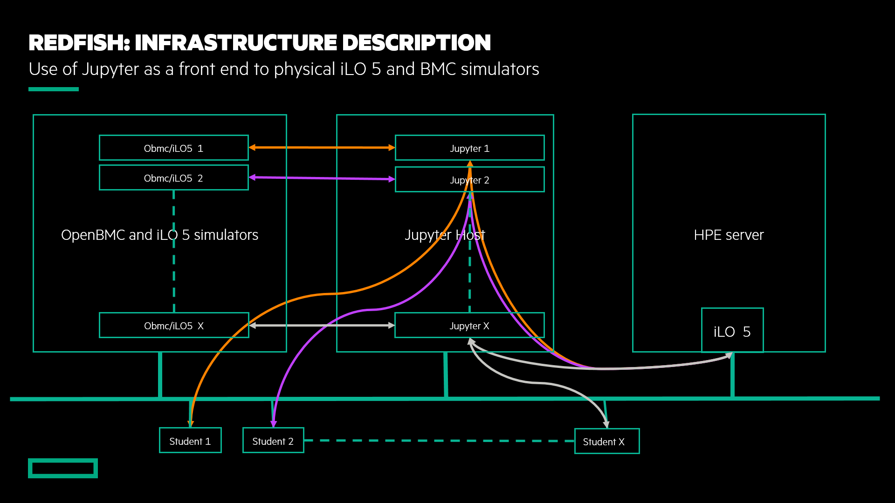

Powered by [HPE DEV Team](https://hpedev.io)

Version 0.51

# Author: [François Donzé](francois.donze@hpe.com)

Watch my videos on [YouTube](https://www.youtube.com/channel/UCIZhrIYcNh3wHLiY4ola5ew) and read my [blogs](https://developer.hpe.com/blog)

# Introduction to Redfish API use With PowerShell, Python and Bash/cURL

**Abstract**: After a quick positioning of the DMTF Redfish API, we'll explore a Redfish tree to understand its basic structure. In addition we'll learn how to modify resources and perform actions using different tools. Best practices will be presented as well. Beginners and experts are welcome.

## Handouts
You can freely copy the Jupyter Notebooks, including their output, in order to practice back at your office at your own pace, leveraging a local installation of Jupyter Notebook on your laptop.
- You install the Jupyter Notebook application from [here](https://jupyter.org/install). 
- A Beginners Guide is also available [here](https://jupyter-notebook-beginner-guide.readthedocs.io/en/latest/what_is_jupyter.html)
To download the notebooks, just right click on them and select `Download`.

In a nutshell, a notebook works as follows:

• A Notebook is a series de cells

• Notebook uses a kernel (visible in the upper right corner of the Notebook)

• Cell can be Markdown or Code (in the selected kernel)

• To Run a cell use:

    o The Play Button at the top
    o Ctrl-Enter (run and stay on same cell)
    o Shift-Enter (run and move to next cell)
    
• Running a markdown cell is just rendering it

• Running a Code cell runs the code and display the output just below the cell

• When a cell is running it displays a [*] to its left, then when finished, it displays a counter of the number of execution of that cell

• You cannot run a cell when another is already running but you can interrupt a running cell with the stop button

 

## Workshop goal

At the end of the workshop, you should be able to 1) explain the basic architecture of the Redfish resource tree; 2) explain why it is crucial to follow [best practices](https://developer.hpe.com/blog/getting-started-with-ilo-restful-api-redfish-api-conformance) when programming the Redfish API; and 3) explain the session-based authentication mechanism.

## Workshop infrastructure

Each student, or team, has a dedicated [Jupyter](https://jupyter.org/) environment hosted by a Linux host that provides a set of [Jupyter notebooks](https://jupyter-notebook-beginner-guide.readthedocs.io/en/latest/what_is_jupyter.html).

The notebooks can access a dedicated [OpenBMC](https://www.openbmc.org/) appliance simulator with `GET` and `SET` methods, and a shared [HPE iLO 5](http://hpe.com/info/ilo) (in `GET` mode only).

 

# Lab description

> **NOTE**: Since the content of [Lab 1](1-Discover-RedfishBash.ipynb) and [Lab 2](2-Discover-RedfishPowerShell.ipynb) are identical, you can choose either one depending on your skills and preferences. If you are more Linux/Bash/cURL oriented, choose  [Lab 1](1-Discover-RedfishBash.ipynb). If you are more Windows/PowerShell focused, choose [Lab 2](2-Discover-RedfishPowerShell.ipynb). 

### [Lab 1](1-RedfishBash.ipynb): Redfish overview using Bash/cURL

Redfish tree overview using [Bash](https://www.gnu.org/software/bash/) and [cURL](https://curl.haxx.se/) tool against an OpenBMC simulator followed by a reset of the OpenBMC. Choose this lab if you are more Linux/Bash/cURL oriented.

### [Lab 2](2-RedfishPowerShell.ipynb): Redfish overview using PowerShell
Identical to Lab 1, but uses PowerShell commands. Choose this lab if you are more Windows/PowerShell focused.

### [Lab 3](3-RedfishPython.ipynb): Browsing multiple Redfish implementations using a single piece of code
Single Python program to retrieve MAC addresses from an OpenBMC and from an HPE iLO 5. 

