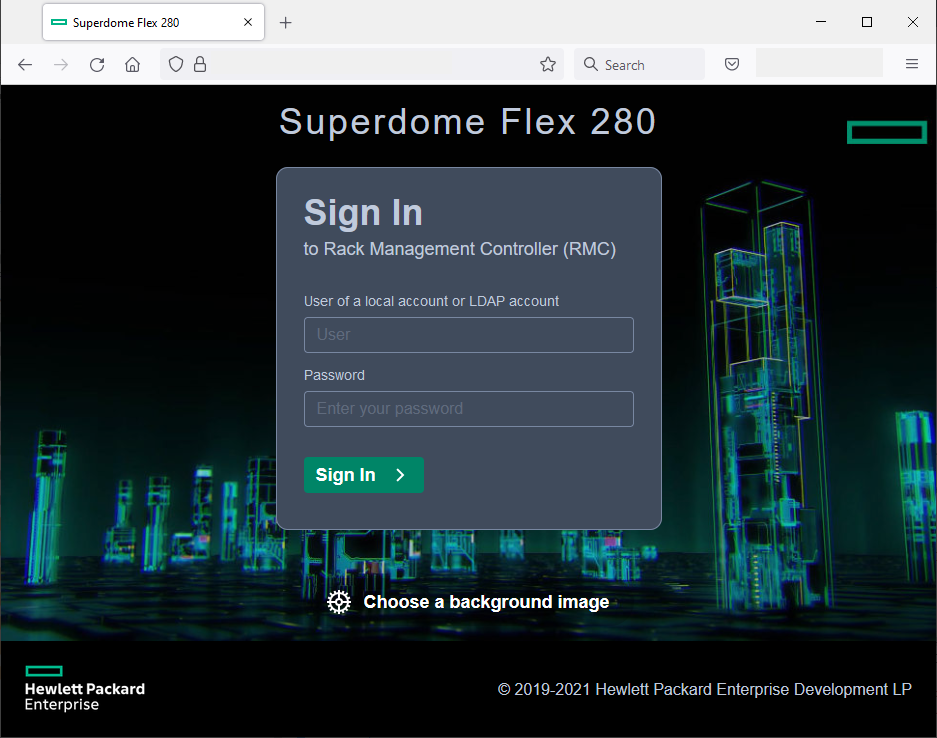

[HPE Developer Community Team](https://hpedev.io)

Version 0.11

# Introduction to the management of the HPE Superdome Flex 280

&nbsp; &nbsp; &nbsp; &nbsp; &nbsp; &nbsp; &nbsp; &nbsp; &nbsp;

## Authors: [Han Pilmeyer](han.pilmeyer@hpe.com), [Dennis Parbutt](dennis.parbutt@hpe.com), [François Donzé](francois.donze@hpe.com)

Feel free to watch Redfish related videos on [YouTube](https://www.youtube.com/playlist?list=PLmYBqUM74OygZjhoZMEZmMP50Od8EfaW8) and read [blogs](https://developer.hpe.com/search?term=redfish) posts.

## Handouts
You can freely copy the Jupyter Notebooks used in this workshop, including their output, in order to practice back at your office at your own pace, leveraging a local installation of Jupyter Notebook on your laptop. To download the notebooks, right click on them in the left sidebar of this Jupyter window and select `Download`.

- You can download the Jupyter Notebook application from [here](https://jupyter.org/install) 
- A Beginners Guide is also available [here](https://jupyter-notebook-beginner-guide.readthedocs.io/en/latest/what_is_jupyter.html)

In a nutshell, a notebook works as follows:

• A Notebook is a series de cells

• Notebook uses a kernel (visible in the upper right corner of the Notebook)

• Cell can be Markdown or Code (in the selected kernel)

• To Run a cell use:

    o The Play Button at the top
    o Ctrl-Enter (run and stay on same cell)
    o Shift-Enter (run and move to next cell)
    
• Running a markdown cell is just rendering it

• Running a Code cell runs the code and display the output just below the cell

• When a cell is running it displays a [*] to its left, then when finished, it displays a counter of the number of execution of that cell

• You cannot run a cell when another is already running but you can interrupt a running cell with the stop button

## Workshop goals

The goal of this workshop is to present the HPE Superdome Flex 280 Remote Management Controller graphical interface.

This goal is achieved through exercises performed against Superdome Flex 280 GUI and Redfish simmulators.

> NOTE: Creating your own Redfish Superdome Flex RMC simulator is explained in [this article](https://developer.hpe.com/blog/build-your-own-ilo-redfish-simulator/). The GUI simulator is HPE proprietary.

## Disclaimer

The material presented in this workshop has been designed to be educative and didactic. Security, error handling, performance, and programming best practices have not been correctly implemented on purpose.

## Workshop infrastructure

Each student has a dedicated [Jupyter](https://jupyter.org/) environment hosted by a Linux host that provides a set of [Jupyter Notebooks](https://jupyter-notebook-beginner-guide.readthedocs.io/en/latest/what_is_jupyter.html).

>Note: Your simulators may not always respond exactly like real RMC, but this will not alter the content of the workshop.

## Workshop description

The material available in this workshop consists of the following Jupyter Notebooks. Double click on them sequentially in the left sidebar before reading or executing their content:

- Introduction (this notebook)
- [Lab 1](1-RetrieveOneViewToken.ipynb): Retrieve an HPE OneView Single Sign On iLO 5 session token
- [Lab 2](2-SdfRedfish.ipynb)
- [Conclusion](3-Conclusion.ipynb)
