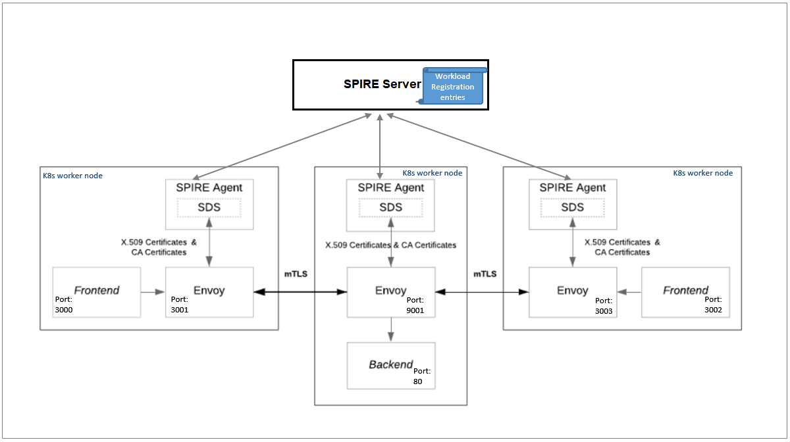

# Welcome to the Hack Shack
Powered by [HPE DEV Team](https://hpedev.io)

<p align="center">
  
  
</p>

# Workshops-on-Demand

# Securing Microservice Communication with Envoy using X.509 SPIFFE IDs 

This workshop will get you started with SPIRE and Envoy Secret Directory Service (SDS) to create a **Zero Trust** security model within a microservice architecture in Kubernetes. A Zero Trust security model uses cryptographic identities for authenticating every system and application services, and allows these services to establish a two-way (mutual) authentication and communicate securily in the environment. 

SPIRE is the production-ready implementation of the Secure Production Identity Framework for Everyone (SPIFFE) open-source specifications for implementing a Zero Trust security model through an Identity control plane and for establishing trust among services in dynamic and heterogeneous environments. The heart of these specifications is the one that defines short lived cryptographic identity documents called **SVIDs** (SPIFFE Verifiable Identity Document). Services can retrieve their service identities through the SPIRE **Workload API** and then use these identity documents when authenticating to other services, for example when establishing end-to-end mutual TLS (mTLS) encrypted connections and communicate securely, thus creating a Zero Trust security model.

It may be challenging for organizations to modify their applications to use the SPIRE Workload API directly. **Envoy sidecar proxy** can be used to connect to the SPIRE Workload API, retrieve the service identities, and encrypt and authenticate traffic on behalf of the applications. Envoy is a self contained process that is designed to run alongside every application service.

In this workshop, you'll go through the deployment of three containerized applications (2 frontend services and 1 backend service) in a Kubernetes cluster and the configuration of **Envoy sidecar proxies** sitting in front of these applications. The Envoy proxies will be configured to use the SPIRE Agent SDS implementation and establish secure communication through mTLS connections on behalf of the applications. You'll configure the existing SPIRE system to provide service identity to Envoy proxy services in the form of X.509 certificates (aka X.509 SVIDs) that will be consumed by Envoy proxies, so the applications can communicate securely.

For this hands-on workshop, the SPIRE components (Server and Agents) have already been deployed in a Kubernetes cluster managed by **HPE Ezmeral Runtime** (formerly known as HPE Ezmeral Container Platform). For more information on how to get a SPIRE Server and SPIRE Agent running in a Kubernetes cluster, check out [here](https://spiffe.io/docs/latest/try/getting-started-k8s/). 

A SPIRE deployment is composed of a SPIRE Server and a SPIRE Agent installed on each Kubernetes worker node on which a service is running: 

**SPIRE Server:** This component acts as a signing authority for identities issued to a set of services via agents. It is responsible for generating and signing all X.509 certificates (SVIDs) in the entire system. It also maintains a registry of service identities and the conditions that must be verified in order for those identities to be issued.

**SPIRE Agent:** This component is responsible for delivering identities to the workload services. It seats on each Kubernetes worker nodes and it is responsible for serving the *Workload API* and for providing identified services with their certificate SVIDs. By default, SPIRE Agent acts as SDS Provider for Envoy.


# Author: [Name](mailto:email)

## Handouts
You can freely copy the Jupyter Notebooks, including their output, in order to practice back at your office at your own pace, leveraging a local installation of Jupyter Notebook on your laptop.

- You install the Jupyter Notebook application from [here](https://jupyter.org/install). 
- A Beginners Guide is also available [here](https://jupyter-notebook-beginner-guide.readthedocs.io/en/latest/what_is_jupyter.html)


Enjoy the labs ! :-)


## Workflow
 
To illustrate how SPIRE can be used for application identity management and allow services to establish secure communication through mTLS connections, we create a simple scenario with three services. One service will be the **backend** application that is a simple nginx instance serving static data, with Envoy as a sidecar proxy to handle X.509 certificates (SVIDs), certificate rotation and encrypted mTLS communication on behalf of the backend service. On the other side, we run two instances of the Symbank demo banking application acting as the **frontend** services, with Envoy as a sidecar proxy to also handle X.509 certificate (SVIDs), certificate rotation and encrypted mTLS communication on behalf of frontend services. The Symbank frontend services send HTTP requests to the nginx backend to get the user account details. The Envoy proxies run in the same POD as the Frontend and Backend PODs, encrypt and authenticate traffic. 


<p align="center">
  

As shown in the diagram, to use SPIRE to establish mTLS connection between workloads requires the following:
   
* The application services (containerized application running on the Kubernetes cluster) along with their Envoy sidecar proxy,
* A SPIRE Server (already deployed in the Kubernetes cluster),
* A SPIRE Agent already deployed on each K8s worker node and that also acts as SDS Provider for Envoy that issues identity documents to Envoy proxies on application service's behalf,
* Creation of registration entries on SPIRE Server to identify services and issue the service identifier (SPIFFE ID) and X.509 certificates (SVIDs) for the services,
* Configuration of Envoy sidecar proxies sitting in front of the backend and frontend services, so they request their service identities to SPIRE and establish encrypted mTLS connections on each application service's behalf. 

In this hands-on technical workshop you will learn how to:

* Deploy the application services (Backend, Frontend services) with Envoy as proxy on Kubernetes cluster managed by HPE Ezmeral Container Platform.
* Create registration entries on the SPIRE Server for the Envoy sidecar proxy instances sitting in front of the application services.
* Test successful X.509 authentication for mTLS connection between the application services through the Envoy proxies.
* Configure an Envoy RBAC HTTP filter policy.
    
**Note:** In this workshop, you will all share the resources of the same Kubernetes Cluster.
    
### Lab 1: Authenticate as tenant user to HPE Ezmeral Runtime
In this first lab, you will connect to the HPE Ezmeral Runtime REST API endpoint and retrieve an authentication session token to be used for fetching the KubeConfig file you will need to interact with the Kubernetes cluster available for your tenant.
    
* [Lab 1](1-WKSHP-SPIRE-Envoy-X509-Get-Kubeconfig.ipynb)

### Lab 2: Deploy application services and configure their Envoy sidecar proxy
In this second lab, you will deploy the application services and configure Envoy sidecar proxies and SPIRE to consume X.509 certificates provided by SPIRE, and test successful X.509 authentication for encrypted mTLS connection between the application services through the Envoy proxies.
    
* [Lab 2](2-WKSHP-SPIRE-Envoy-X509-Deploy-Workloads.ipynb)
    
# Thank you!


```python

```
