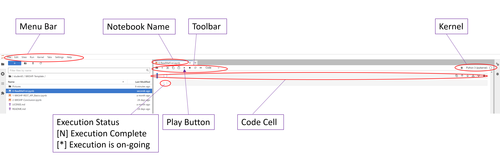

# Welcome to the HPE Developer Hack Shack
[HPE Developer Community Team](https://hpedev.io)

<p align="center">
  
  
</p>

# HPE Developer Workshop


# Introduction to[Workshop title]
In this workshop we’ll cover ....

# Author: [Name](mailto:email)


## Lab flow
HPE Developer Workshops-on-Demand are delivered through a central point that allows a portable, dynamic version of the lab guides. Rather than using standard PDF files that always end in copy / paste errors from the lab guide into TS sessions, we leverage an infrastructure that uses a JupyterHub server on which all the different lab guides are stored in a notebook format (*.ipynb).

## A quick look at Jupyter Notebook
Jupyter Notebook is an open source solution for interactive documents that are commonly used to hold code for ML/DL models. But it can also be used in many other ways.
A notebook consists of cells. A cell can be either a markdown cell (contains comments, text, images) or a code cell. 


• A notebook is a series of cells

• The notebook uses a kernel (visible in the upper right corner of the notebook)

• A cell can be either markdown or code (in the selected kernel)





• To run a cell use:

    o The Play button at the top
    o Ctrl-Enter (run and stay on same cell)
    o Shift-Enter (run and move to next cell)
    

> **Note:**  When you see an [*] next to the action, it means your execution step is busy working within the notebook. When you see a digit number, it means the execution of the step is completed.  
    
• Running a markdown cell just renders it

• Running a code cell runs the code and displays the output just below the cell

• When a cell is running, it displays an [*] to its left. Then, when finished, it displays a counter of the number of executions of that cell

• You cannot run a cell when another is already running, but you can interrupt a running cell with the stop button


Enjoy the labs ! :-)

## Handouts
You can freely copy these Jupyter Notebooks, including their output, in order to practice back at your office at your own pace, leveraging a local installation of Jupyter Notebook on your laptop.
- If you want to Install the Jupyter Notebook application on your own laptop for further tests after this workshop, please start from [here](https://jupyter.org/install) 
- If you want to learn more about Notebooks, a Beginners Guide is available [here](https://jupyter-notebook-beginner-guide.readthedocs.io/en/latest/what_is_jupyter.html)

## Workflow

### Lab 1: Lab 1 title
Description: In this section, we’ll go through some of ...
* [Lab 1](1-WKSHP-title.ipynb)


# Thank you!


```python

```
