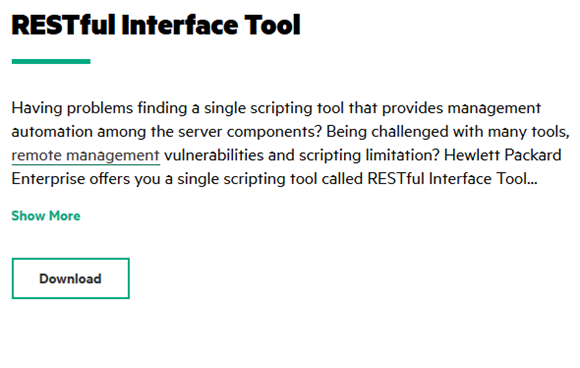

Powered by [HPE DEV Team](https://hpedev.io)

Version 0.53

# Author: [François Donzé](francois.donze@hpe.com)

Watch Redfish videos on [YouTube](https://www.youtube.com/channel/UCIZhrIYcNh3wHLiY4ola5ew) and [blogs](https://developer.hpe.com/search?term=redfish)

# Introduction to iLOrest, the HPE RESTful Interface tool

## Handouts
You can freely copy the Jupyter Notebooks used in this workshop, including their output, in order to practice back at your office at your own pace, leveraging a local installation of Jupyter Notebook on your laptop. To download the notebooks, right click on them in the left sidebar of this Jupyter window and select `Download`.

- You can download the Jupyter Notebook application from [here](https://jupyter.org/install) 
- A Beginners Guide is also available [here](https://jupyter-notebook-beginner-guide.readthedocs.io/en/latest/what_is_jupyter.html)

## Workshop goals

The goal of this workshop is to present an overview of the HPE [iLOrest](http://hpe.com/info/resttool) RESTful interface tool. After a brief introduction, the following iLOrest operating modes will be presented:

- In-band and out-of-band management
- Interactive, scripted and file based

You will able to perform and test numerous examples using the infrastructure depicted below.

## Disclaimer
The material presented in this workshop cannot be considered as a replacement of the [official documentation](https://hewlettpackard.github.io/python-redfish-utility/#installset-command). It is a complement to it aimed at enhancing the HPE Redfish ecosystem.

## Workshop infrastructure

Each student has a dedicated [Jupyter](https://jupyter.org/) environment hosted by a Linux host that provides a set of [Jupyter Notebooks](https://jupyter-notebook-beginner-guide.readthedocs.io/en/latest/what_is_jupyter.html).

The Jupyter Notebooks can access a dedicated [OpenBMC](https://www.openbmc.org/)  simulator and a [DMTF Redfish server]( https://github.com/DMTF/Redfish-Mockup-Server) populated with iLO 5 data. Read this [article](https://developer.hpe.com/blog/build-your-own-ilo-redfish-simulator/) to build your own iLO 5 simulator. 

The OpenBMC and the iLO 5 simulators support `GET` and `SET` methods. You can also access a shared [HPE iLO 5](http://hpe.com/info/ilo) in `GET` mode only.

## Workshop description

The material available in this workshop consists of the following Jupyter Notebooks. Double click on them sequentially in the left sidebar before reading or exectuting their content:

- Introduction (this notebook)
- [Lab 1](1-iloRestBasics.ipynb): iLOrest overview
- [Lab 2](2-iloRestExamples.ipynb): library of iloREST examples
- [Conclusion](3-Conclusion.ipynb)
